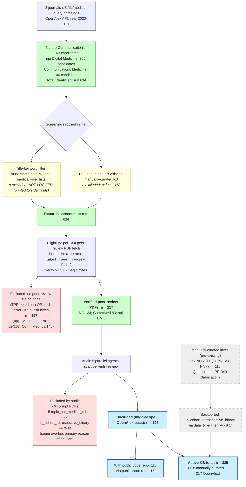

# PRISMA-2020 Flow: ml-leakage-guard Peer-Review Corpus Assembly

**Source-of-truth files**
- `paper/discovery-candidates.json` (614 candidates after title-filter+dedup)
- `paper/kb-merge-report.md` (614 → 217 with verified PDFs)
- `paper/expanded-corpus-status.json` (status sample, n=5; not full log)
- `references/case-studies/peer-review-kb.json` → `provenance.integrity_audits` (audit history)
- `paper/corpus-statistics.md` (verified live-computed figures)
- `paper/code-repos-cohort-binary.json` (125 in-scope; 110 with public code)

Computed: 2026-05-10. All counts are aggregate; only paper IDs (factual identifiers) appear. No titles/abstracts/reviewer text reproduced.

---

## Stage 1 — Identification

OpenAlex API queried with `filter=primary_location.source.id:<journal>,publication_year:2020-2026` plus `search=<query>`, repeated for **3 journals × 8 medical-ML query phrasings = 24 (journal × query) cells**.

### 1.1 Journals targeted
| Source ID | Journal | Approx. corpus size on OpenAlex |
|---|---|---:|
| S64187185 | Nature Communications | 87,990 works |
| S4210195431 | npj Digital Medicine | 2,676 works |
| S4210167893 | Communications Medicine | 1,612 works |

### 1.2 Query phrasings (n=8)
1. machine learning clinical prediction
2. deep learning medical diagnosis
3. machine learning EHR cohort
4. risk prediction model patient
5. AI clinical decision support
6. neural network disease prediction
7. machine learning prognosis
8. cohort study prediction model

### 1.3 Hits per (journal × query) cell — **after** in-loop title-keyword filter and DOI dedup, **before** PDF retrieval
The discovery script applies the title-keyword filter (must match BOTH an ML word AND a medical word) and the existing-KB-DOI dedup inline during the search loop, then writes only the surviving union of DOIs. Per-cell **raw** OpenAlex hit counts are printed to stderr at runtime but **not persisted** to disk — they are not recoverable from logged data. The numbers below are the per-cell counts of DOIs that survived all filters and reached `discovery-candidates.json`.

| Journal \ Query | ML clin pred | DL med dx | ML EHR cohort | Risk pred patient | AI CDS | NN disease pred | ML prognosis | Cohort pred model | **Row total** |
|---|---:|---:|---:|---:|---:|---:|---:|---:|---:|
| Nature Communications | 60 | 31 | 13 | 16 | 8 | 15 | 11 | 9 | **163** |
| npj Digital Medicine | 109 | 34 | 64 | 25 | 19 | 11 | 35 | 8 | **305** |
| Communications Medicine | 81 | 26 | 2 | 12 | 9 | 8 | 3 | 5 | **146** |
| **Column total** | 250 | 91 | 79 | 53 | 36 | 34 | 49 | 22 | **614** |

**Total identified candidates (filtered, deduplicated): N = 614**

> Caveat: 614 is the union after DOI dedup across queries within journal as well — a single paper matched by 2 query phrasings is counted once. The cell totals therefore double-count cross-query overlaps; the **614** is the unique union.

---

## Stage 2 — Screening

Screening filters were applied **inline** within the OpenAlex query loop and as a post-merge integrity check.

### 2.1 Title-keyword filter (must match both ML and medical word lists)
- ML word list: `machine learning, deep learning, neural network, artificial intelligence, random forest, gradient boost, xgboost, transformer, model, prediction, prognostic, algorithm, classifier, classification`
- Medical word list: `patient, clinical, disease, cohort, hospital, diagnosis, prognosis, health, medical, EHR, electronic health, outcome, mortality, survival, risk, therapy, treatment, ICU, sepsis, cancer, diabetes, heart, kidney, cardiovascular, prediction`
- Rule: title (lowercased) must contain ≥1 ML word AND ≥1 medical word.
- **N excluded by title-keyword filter: NOT DIRECTLY LOGGED.** Per-query raw hit counts are printed to stderr by `scripts/diagnostics/discover_corpus.py` but never persisted. The 614 figure is the surviving count. → Flagged for manual verification (could be re-derived by replaying the OpenAlex queries; subject to OpenAlex result drift).

### 2.2 DOI dedup against existing manually-curated KB
- Existing KB DOIs at time of discovery run: **112** (recorded in `discovery-candidates.json:existing_kb_dois_excluded`).
- These 112 DOIs are excluded from candidates by definition; not counted in the 614.
- **N excluded by DOI dedup ≥ 112** (lower bound — additional in-loop overlaps between query results are not separately counted).

### 2.3 Discovery-stage quarantine
- 1 manually-curated entry (`PR-040`) was later quarantined for fabricated metadata (DOI resolved to an unrelated genome paper). This affects the manually-curated layer, not the OpenAlex-discovered set. After quarantine: manually-curated layer = **118 entries** (111 `PR-NNN` + 7 `PR-RO-NN`).

**N records screened in (carried to eligibility): N = 614**

---

## Stage 3 — Eligibility (full-text / peer-review PDF retrieval)

For each of 614 candidates, `scripts/diagnostics/download_discovered_pdfs.py`:
1. Fetched the `nature.com/articles/<doi_short>` article page (HTML cached).
2. Located the peer review file via `<a data-track-label="peer review file">` anchor.
3. If anchor present, downloaded the linked PDF; verified `%PDF-` magic bytes.
4. Saved PDFs to `references/case-studies/<journal_dir>/<doi_short>_peer_review.pdf`.

### 3.1 Eligibility outcome (per `paper/kb-merge-report.md`)
| Outcome | Count |
|---|---:|
| PDF downloaded and verified (`%PDF-` magic bytes) | **217** |
| Skipped: no peer review file on page (TPR opted out by authors) OR fetch error OR invalid bytes | **397** |
| **Total assessed** | **614** |

### 3.2 Eligibility outcome by journal
| Journal | Candidates assessed | Verified PDFs | Skipped | Skip rate |
|---|---:|---:|---:|---:|
| Nature Communications | 163 | 134 | 29 | 17.8% |
| Communications Medicine | 146 | 83 | 63 | 43.2% |
| npj Digital Medicine | 305 | 0 | 305 | 100% |
| **Total** | **614** | **217** | **397** | **64.7%** |

### 3.3 Granular reasons for the 397 skipped
- **NOT LOGGED at per-DOI granularity in repo.** `paper/expanded-corpus-status.json` contains only a 5-DOI sample (3 downloaded + 2 `no_peer_review_file`), not the full 614-row status table. → Flagged for manual verification.
- Documented via Audit 1 narrative (`peer-review-kb.json:provenance.integrity_audits[1].known_issues_for_paper_writeup`): npj Digital Medicine (305/305 skipped) is attributed to authors not opting in to transparent peer review at that journal — i.e., the article page lacked the `data-track-label="peer review file"` anchor.
- For NC (29 skipped) and CommMed (63 skipped): mix of TPR opt-out, large-file CDN truncation, and fetch failures; per-DOI breakdown not retained.

**N moving to inclusion (verified peer-review PDFs): N = 217**

These 217 entries were merged into the KB as new `PR-EXP-NNNN` records (sequentially numbered `PR-EXP-0001` … `PR-EXP-0217`).

---

## Stage 4 — Audit & Inclusion

The 217 newly-downloaded entries underwent a strict per-entry audit by 5 parallel agents (chunks of ~44 entries each), recorded in `peer-review-kb.json:provenance.integrity_audits[0]`. Each entry was checked for PDF↔title alignment, structured-field extraction, and anomaly flags; each was tagged `is_cohort_retrospective_binary ∈ {true, false}`.

### 4.1 Audit-stage exclusions
| Reason | Count | IDs |
|---|---:|---|
| `pdf_corrupt_or_empty` (corrupt PDF) | 6 | PR-EXP-0007, -0044, -0080, -0150, -0188, -0190 |
| `topic_not_medical_ml` (off-topic false positive of title filter) | 15 | PR-EXP-0091, -0133, -0134, -0136, -0138, -0140, -0156, -0162, -0177, -0180, -0183, -0199, -0215, -0216, -0217 |
| `is_cohort_retrospective_binary == false` (out of mlgg scope: prospective / cross-sectional / non-cohort / non-retrospective) | 92 | (full list in PR-EXP entries with field == false) |

Note: `topic_not_medical_ml` and `is_cohort_retrospective_binary == false` overlap (a topic-mismatch is also out-of-scope by definition). The audit attributes the **primary** exclusion reason; the 92 `false` count is the disjoint complement of the 125 `true`. Of the 6 corrupt PDFs, 3 were successfully re-downloaded post-audit (`PR-EXP-0150`, `-0188`, `-0190`); 2 failed due to >8 MB Nature CDN per-request soft cap (`PR-EXP-0044`, `-0080`); 1 had no TPR link in the article page (`PR-EXP-0007`).

### 4.2 Final inclusion (mlgg-scope corpus from OpenAlex pass)
| Filter | Count |
|---|---:|
| PR-EXP entries with `is_cohort_retrospective_binary == true` | **125** |
| Of those, with verified `peer_review_pdf_path` | 125 |
| Of those, with public code repo (GitHub / Zenodo / Figshare / OSF) | **110** |
| Of those, no public code repo | 15 |

### 4.3 Layered breakdown of full corpus
| Layer | ID pattern | Count | Source |
|---|---|---:|---|
| Original manually-curated | `PR-NNN` (excl. PR-040) | 111 | Pre-existing curation |
| Reporting-summary-only | `PR-RO-NN` | 7 | Pre-existing curation |
| OpenAlex-discovered | `PR-EXP-NNNN` | 217 | This pipeline |
| Quarantined (excluded) | `PR-040` | 1 | Pre-existing; fabricated metadata |
| **Active total in KB** | | **335** | |
| Manually-curated subtotal | | **118** | (= 111 + 7) |

The mlgg-scope filter (`is_cohort_retrospective_binary == true`) was populated by the 5-agent audit on the 217 PR-EXP entries (yielding 125 in-scope) and back-ported by data-type filter to the 118 manually-curated entries (Audit 1, `cohort_binary_backported_to_pr_orig = 118`). Final mlgg-scope corpus from the OpenAlex pass alone = **125**.

---

## Mermaid Diagram

---

## Numbers Flagged for Manual Verification

| Number | Status | Why |
|---|---|---|
| N excluded by title-keyword filter | **NOT LOGGED** | `discover_corpus.py` prints raw OpenAlex hit count to stderr per (journal, query) cell, but writes only the surviving 614 union to disk. Recoverable only by replaying OpenAlex queries (with result drift since 2026-05-10). |
| Per-cell raw OpenAlex hits (24 cells) | **NOT LOGGED** | Same reason. Cell totals in §1.3 are post-filter, post-dedup survivors. |
| N excluded by DOI dedup (exact) | **LOWER BOUND ONLY** | Recorded as `existing_kb_dois_excluded: 112`, but in-loop dedup of duplicate DOIs across queries within the same journal is not separately counted. |
| Per-DOI breakdown of the 397 eligibility-skipped (TPR-opt-out vs fetch-fail vs invalid-bytes) | **NOT LOGGED at full granularity** | `paper/expanded-corpus-status.json` contains only a 5-DOI sample. Aggregate split is documented narratively in `integrity_audits[1].known_issues_for_paper_writeup` (npj DM = systematic TPR opt-out for 305/305). |
| `topic_not_medical_ml` vs `is_cohort_retrospective_binary == false` attribution boundary | **OVERLAP, NOT DISJOINT** | A single excluded entry can have both flags. Counts (15 + 92) are stated separately by the audit; the 92 false-flag count is the complement of the 125 true-flag count and **includes** the 15 topic-mismatch entries. Do not sum 6 + 15 + 92 as disjoint exclusions in the PRISMA boxes; the disjoint exclusion total = 217 − 125 = **92**. |
| Cross-chunk audit-rate divergence (chunk 1: 9.1% true vs chunk 3: 88.6% true) | **REAL, DOCUMENTED** | Year-controlled (2025-only): chunk 1 = 4.3% true vs chunk 3 = 72.2% true. Indicates labeling-rubric divergence between agents. Recommended in `corpus-statistics.md §10` to re-spot ~10 chunk-1 entries before publishing the 125 figure. |
| Corrupt-PDF count discrepancy (4 vs 6) | **DUAL-MARKER INCONSISTENCY** | `_pdf_status == 'corrupt_needs_redownload'` set on 4 entries; `audit_findings.anomaly_flags` flags 6. Reconcile to one canonical field. |
